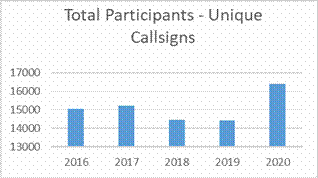
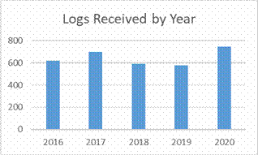
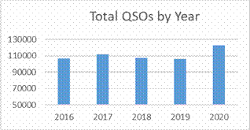
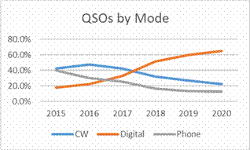

Download a PDF of the full article [here](./2021%20DX%20Marathon%20Results.pdf).

_Great first-time experience. Would like to have worked more countries_ — **W9AP**

_DX Better than 2020. Few more DX-peditions and better	conditions. Had fun_ — **NU8Z**

_Enjoyed 2021 CQ Marathon. My first entry. Worked several new	ones towards end_ — **GW3SFC**

_First Time entry - a lot of fun_ — **VK2EY**

_Fun every year_ — **K9RR**

_Great motivation tool to keep you hunting for DX!_ — **ON6NL**

_Thank you CQ Magazine, the Annual DX Marathon was a blast!_ — **K4AR**

## A year of transition!

The beginning of 2021 saw more COVID, low sunspots and no DX-peditions. But the 2nd half of the year exploded
with great band conditions and plenty of DX. Once again, the DX Marathon set new records for participation —
highest number of participants ever and most QSOs ever in the history of the Marathon. In addition, 3 times as
many all-time records were broken in 2021 compared to 2020. The DX Marathon kept us busy concentrating on DX
and was a great way to reduce stress from the pandemic.

The participation graph shows the amazing growth in 2021. Total participants in the DX Marathon increased to
18,720. That is the highest total in DX Marathon history and a 14% increase over 2020.

We also had a record number of logs submitted and the highest ever number of total QSOs as shown in the graphs.

During low sunspot periods DX signals are weaker, but the multitude of digital modes have allowed anyone to work DX. The
weak signal capability of the digital modes has kept activity high in the DX Marathon. Digital modes accounted for 79%
of all QSOs in the Marathon — an incredible increase from less than 20% in 2015 and 21% increase over 2020. The FT4 and
FT8 modes accounted for most of those digital contacts. The Mode graph shows the change over the last few years.

The maximum possible score in 2021 was 314, an increase of 6 over 2020, but still very impressive considering the world
situation. Only 2 participants scored over 300, but better than 2020 when no one exceeded 300 points. We were very happy
to see that 28 All-time records were broken — a threefold increase over 2020. Some happy hams now have their calls in
the DX Marathon record books. Setting new records in the 2021 environment is a real accomplishment. In terms of band
usage, the higher bands saw the biggest increases in QSOs.

## And the Winners Are…

Since the Marathon was introduced in 2006, we have had winners from NA, EU and SA, but never from Asia. Zorro, JH1AJT,
established a new record by being our first ever DX Marathon winner from Asia. Unfortunately, Zorro passed away from
cancer while this article was being written. Zorro was well known for his many philanthropic contributions, but he also
found time to be very active in the Marathon. Zorro will be sorely missed. Zorro won Unlimited Class with a huge score
of 306 — 5 points more than K2ZJ, last year's Unlimited Class winner and this year's second place winner.
Congratulations to John, K2ZJ for his 2nd place finish at 301 and to George, DJ3AA and Pete, N0FW who tied
for third at 299 points.

James, K2JL, last year's Limited Class winner once again came out on top with a score of 285. Second and third place
positions went to SV2AEL and IK2RPE with scores of 284 and 278, respectively. In Formula Class, 100-watt option, Karel,
OK2FD, was our repeat winner with a score of 291. EA8DHH and PY2DPM finished 2nd and 3rd
respectively with scores of 265 and 261. Working the Marathon with wire antennas is a real challenge but working DX with
QRP power is a real challenge. Congratulations to Milan, OK2AP, for a repeat win in the QRP category with a score of 282
points. IZ3VR and WG5G finished second and third with scores of 268 and 266 respectively.

In 2021, 30% of the DX Marathon participants choose to submit scores for a single mode, an 18% increase over 2020. In
2021 we saw nice increases in single mode submissions for all three modes. Lada, OK2PAY, continues his love of CW and is
now a seven-time CW only plaque winner! Lada topped the world with his CW only score of 266. PA3FQA came in second with
a score of 252. We had a tie for the top North America CW score at 230 by both Bob, K5BG and Jack, W4JS. In the case of
a tie, top honors go to the participant with the earliest date of the last QSO submitted. Bob beat Jack by 2 days! Both
Lada and Bob will soon hold a beautiful DX Marathon CW plaque for their efforts. The Digital only category continues to
show big scores with a tie at 284 points — higher than the CW and Phone only scores. Jan, OM5XX and Savvas, SV2AEL share
the top spot, but the plaque goes to OM5XX as his last country worked was one week earlier than SV2AEL. N3SL and PY7ZZ
tied for third at 283 — just one point behind the winners! A lot of competition for the Digital only plaque! Julio,
W4HY, who finished in first place last year repeated his top position with a score of 252. PY5QW came in second at 247.
Thanks for keeping Phone DX alive!

In addition to the overall and Mode plaques, each year we award plaques to the top score on each Continent plus the
highest score on each of the 10 through 80-meter bands. Top honors for Africa went to repeat winner CT3MD with his top
score of 279 with second place to EA8DHH with a score of 265 and 3rd place went to ZS2EZ with a score of 249.
In Asia, the top score went to JH1AJT as described earlier, with TA2LG finishing second in Asia with a score of 291.
JA0DAI came in 3rd at 287 points. In Europe, last year's second place winner, DJ3AA, moved to the top Europe
spot with a score of 299. OM3EY and OK2FD tied for second with their scores of 291. In Oceania, Anton, YB5QZ, once again
took top honors with a score of 291 very closely followed by a previous Oceania winner, VK3GA, at 286. The top North
American score was by K2ZJ at 297, who was the Unlimited Class plaque winner in 2020. Pete, N0FW, came in second at 299.
PY7ZZ took home top South America honors with a score of 283, followed closely by HK3W with a score of 282.

About 10% of DX Marathon participants submit single band scores each year and 2021 was no different. However, the Band
mix was quite different this year. As would be expected, we saw a big increase in the 6, 10, 15 and 17 meter single band
submissions, while there was a decrease in 20, 40 and 160 meter only submissions. Clearly the improved band conditions
were welcomed by all. 10 meters was once again won by 9A2EU with a score of 201, a nice increase over
2020. Veteran marathoner PY5EG had the top 12-meter score of 240. The 15-meter winner was PU2UAF at 262 points. Top
score on 17 was from PY2TC with a total of 274 points. VE3VEE was once again the king of 20 meters with his top score of
297. 20 meters was the hot band for 2021, as Marvin's 20 meter only score put him in 5th place overall worldwide. K2TQC
took top 30-meter honors with a score of 259. PY4AZ took the top 40-meter spot with a score of 269. He was followed
closely by W9KNI with his score of 256, which was done without using the new digital modes — a very impressive
accomplishment. Starting in 2020, we are now awarding a Single Band plaque for the 60-meter band. Once again, the top
score wa— done by Ken, W1NG, with a very impressive score of 196! The 80-meter plaque was won by PP5JR with a score of
233. Congratulations to all the single Band plaque winners. The impressive 160-meter score of 174 will earn LA3MHA a
nice certificate for taking top honors on top band. F4GGJ was the king of 6 meters with an incredible score of 162.

In addition to the 2021 Plaque winners, we are awarding 98 Certificates of Achievement for various categories. Please
consult the detailed listings for the calls of the certificate winners. Certificates are awarded for the highest 6 meter
and 160-meter scores, top continental score for each of the three modes, top score in each country, top score in each CQ
zone, top score in each Canadian call district, top score in each USA call area for each of the four DX Marathon classes
plus the top single mode score in the USA. Congratulations to all the 2021 certificate winners!

Despite a big drop in the maximum possible score due to the lack of DX-peditions, 28 All-time records were broken in
2021! New records included 15 new country records, four new USA Call Area records, four new Continental mode records,
new records on the 6- and 60-meter bands plus one record for Clubs, Zones and Canadian call areas. Even with reduced DX
activity, breaking records is still very possible.

In the popular Club competition, the Rio DX Group in Brazil took top honors with an aggregated score of 15,102 pushing
the previous Club winner CDR Group in Brazil to second place at 10,891. The top North American club score, and third
overall, was by the Western Washington DX Club at 9,733. Perennial North American winner, the Northern Illinois Dx
Association, fell to 4th place with a score of 8898. Don't forget to include your club's name on your 2022 DX
Marathon submission.

## Some Operating Advice

Each year the DX Marathon website publishes a large amount of information to help participants minimize errors in their
submissions. The Helpful Hints page can be accessed from the DX Marathon home page. In 2021, we published over 1,000
callsign exceptions and notes to help every participant reduce the number of errors in their submissions. We also
recommend that you regularly update your logging program callsign database if it has one. Unusual callsign prefixes seem
to multiply every year, so updating your program's database is critical to properly determine the DX location and/or
Zone.

In 2021, the number of participants with no errors increased from 22% in 2019 to 26% in 2021. We are very happy to see
the improvement, but that means 74% of our entrants made at least one error. Fortunately, the overall error rate for
those who did make mistakes decreased from 1.7% to 1.5% - a significant improvement. The highest error category was once
again Wrong Zone which accounted for 32% of all errors made. Confusion with USA Zones is one of the biggest sources of
Zone errors. It is especially important to note that USA callsign numbers are no longer required to match their QTH. A
W6 could be in New York, or a KL7 could be in Puerto Rico. In addition to the USA, there are many special callsigns in
Russia that do not follow the traditional callsign mapping, thus creating many errors in zones 16,17,18 and 19. Zone 2
also continues to be a problem. Very few VE2 stations are in Zone 2 — most are in Zone 5. The DX Marathon website does
list the most active Zone 2 stations. The next highest error category was Invalid Callsigns — callsigns that were
entered by participants, but do not actually exist. These callsign errors accounted for 27% of all errors. Wrong Country
accounted for 23% of all score reductions. Busted Call errors dropped from last year to 14%. There were many unique
callsigns used in 2021 so it is critical to review your DX Marathon submission carefully. The number of bad spots on the
DX Clusters also remains a big problem.

When logging a QSO from a DX spot, listen carefully to the DX station to make sure the callsign is logged
correctly. 37% of all point subtractions were due to Busted or Incorrect callsigns. Some Invalid callsigns may have been
busted calls that were so bad that we could not determine the real callsign. Once again there were many mix-ups between
"0" (Zero) and "O" (Oh). The computer is not forgiving, so check your log carefully! The database that is used for
scoring the DX Marathon includes start and end dates for all major expeditions, so please make sure that dates and times
are properly logged along with the callsign, country and zone for each QSO. With more logs being posted online, it is
easy to check if you are in the log before entering that QSO in the DX Marathon. We do publish a lot of helpful
information on the DX Marathon website, but there is nothing we can do to make sure you are in the log. Unfortunately,
subtractions due to pirates tripled from 2020.

As part of this article, you will find a complete listing of all scores plus a listing of the Top Scores in all
available categories. The DX Marathon website will include additional information and details on the 2021 results plus
photos of plaque winners as they become available. For any questions or comments about the DX Marathon, please contact
the author.

## Special Thanks

The DX Marathon would not be possible without the incredible help and assistance from so many people. The team effort
makes the DX Marathon possible. I want to first thank CQ Magazine for developing the Marathon and providing continuing
support. One of the first hams to jump in was Alex, VE3NEA, who has created the DX Marathon scoring software. He
continues to provide updates as required. Without his software, there would not be a DX Marathon. A special thanks goes
to Jim, AD1C, who has created the very popular ADIF to DX Marathon software used by almost 70% of all entrants. I also
thank our many plaque sponsors who make our winners incredibly happy each year. Mike, W9MR, wrote our online submission
and log checking tool for which we are grateful. Dave, AA6YQ, has created powerful DX Marathon tracking tools in his DX
Labs software which we really appreciate. John, W9ILY, creates the DX Marathon certificates — thank you, John. A special
thank you goes to W9KNI and PY5EG for their incredible support of the Marathon and their constant encouragement over the
years. Bernie, W3UR, has also been a tremendous supporter by including lots of DX Marathon in his Daily DX newsletter. I
also thank Laurie, VK3AMA, for including DX Marathon support in his popular JT Alert software. Of course, none of this
would be possible without you — our valuable readers and participants in the DX Marathon. Thank you for your
participation in 2021 and best of luck in 2022!
